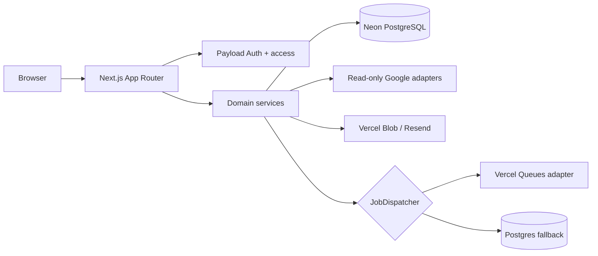

# Architecture

React Server Components render the initial analytics surface. Mutations use server route
boundaries with Zod validation, trusted tenant context, same-origin checks, and rate
limits. Large syncs are split by account/date and dispatched. Payload collections hold
identity, tenancy, configuration, and facts; high-volume facts are indexed by tenant and
date. Domain calculations remain outside React.

Compatibility is pinned in `package.json`: Next.js 16.2.12, React 19.2.8, Payload 3.86.0,
Tailwind 4.3.3, Recharts 3.10.1, TanStack Table 8.21.3, Vitest 4.1.10, and Playwright
1.62.0. Payload's official compatibility table supports Next 16.2.6+.
