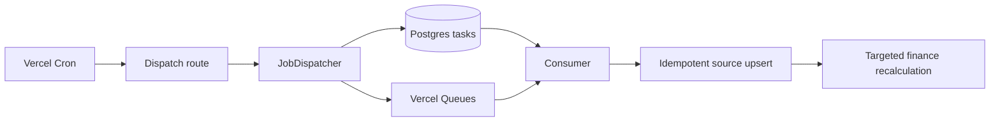

# Background jobs

Jobs carry tenant, idempotency key, correlation ID, attempt count, run time, and maximum
attempts. Retryable quota/network/5xx failures use exponential backoff with jitter.
Permanent or exhausted work moves to dead-letter. Large syncs must split by source
account/date/app; a failed organization never blocks another.
