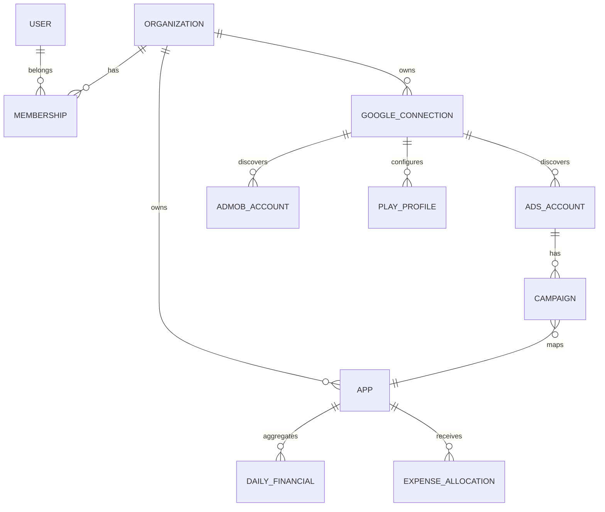

# Data model

The Payload configuration declares all 38 required entities. UUIDs are used throughout.
Every tenant collection has a required indexed `organization` relationship. Key compound
constraints cover canonical package names, Google customer/publisher IDs, campaigns, and
daily source grains.

Money stores a numeric value and ISO currency. Micros are retained at source grain.
Source metadata is supplementary JSON; filterable metrics have typed columns.
