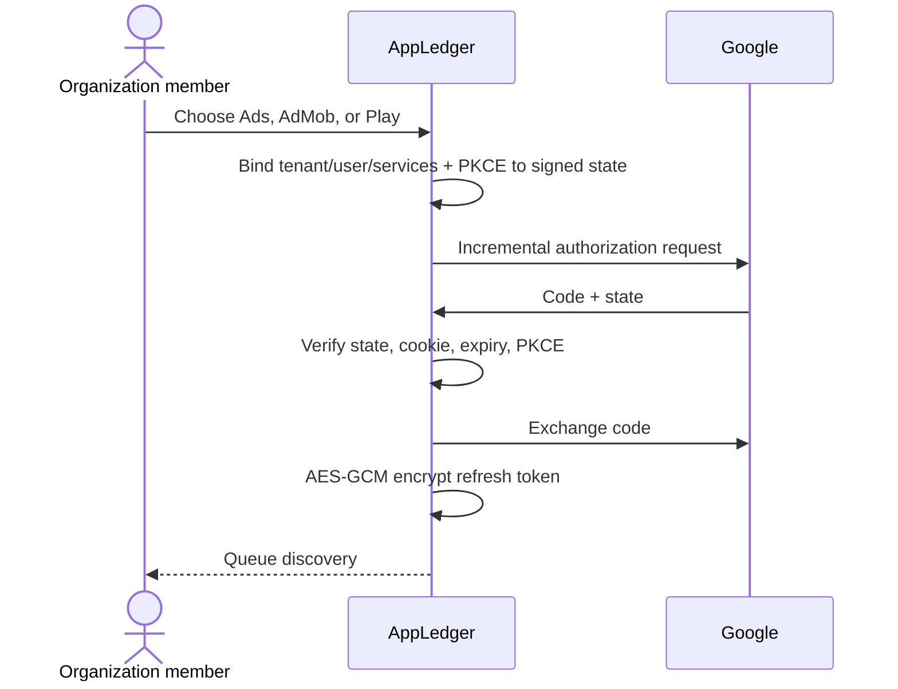

# Google OAuth setup

Configure the consent screen, verified domain, privacy/terms URLs, client credentials, and
exact callbacks described in `ENVIRONMENT_SETUP.md`.

Google OAuth connects reporting identities; it is not AppLedger login. Disconnect revokes
future sync and deletes stored token material while preserving historical data.
